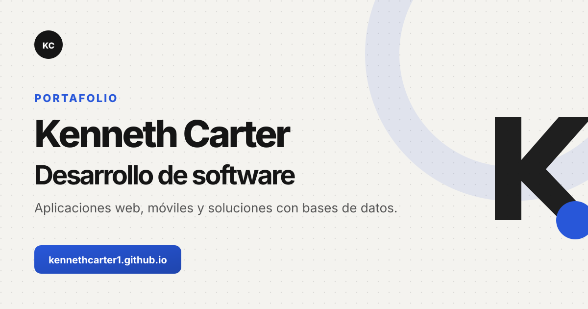

# Portafolio de Kenneth Carter

Portafolio personal de Kenneth Carter, estudiante de la Licenciatura en Desarrollo y Gestión de Software de la Universidad Tecnológica de Panamá.

El sitio presenta mi perfil, formación, herramientas técnicas y una selección de proyectos web, móviles y de escritorio desarrollados durante mi formación.

[Ver portafolio publicado](https://kennethcarter1.github.io/Portafolio/)



## Características

- Diseño adaptable para computadoras, tabletas y teléfonos.
- Navegación activa según la sección visible.
- Menú accesible para dispositivos móviles.
- Presentación de proyectos con imágenes, tecnologías y enlaces a sus repositorios.
- Descarga directa del currículum.
- Animaciones de aparición compatibles con la preferencia de movimiento reducido.
- Metadatos SEO, Open Graph y Twitter Card para compartir el sitio.
- Navegación mediante teclado, enlace para saltar al contenido y textos alternativos.
- Código desarrollado sin frameworks ni dependencias de compilación.

## Tecnologías

- HTML5
- CSS3
- JavaScript
- Font Awesome
- Devicon
- Google Fonts
- GitHub Pages

## Proyectos incluidos

| Proyecto | Tipo | Tecnologías principales | Repositorio |
| --- | --- | --- | --- |
| Elyra | Plataforma web | PHP, JavaScript, MySQL, SOAP | [Ver código](https://github.com/KennethCarter1/Elyra-Web-Anime-Peliculas-Series) |
| Alethea | Aplicación Android | Kotlin, XML, SQLite | [Ver código](https://github.com/KennethCarter1/Alethea) |
| Recetas de Cocina | Aplicación web | C#, ASP.NET MVC, Web API, SQL Server | [Ver código](https://github.com/KennethCarter1/Proyecto-Final-Ds4) |
| PokéFinder | Aplicación web | HTML, CSS, JavaScript, REST API | [Ver código](https://github.com/KennethCarter1/Proyecto-Semestral-Pok-Finder) |
| Administrador de Órdenes | Aplicación Android | Kotlin, SQLite | [Ver código](https://github.com/KennethCarter1/Administrador-de-Ordenes) |
| Registro de Aspirantes | Sistema web | PHP, MySQL | [Ver código](https://github.com/KennethCarter1/Parcial2-Aspirantes) |
| Proyecto de Contabilidad | Sistema web | PHP, JavaScript | [Ver código](https://github.com/KennethCarter1/Proyecto-Contabilidad) |

## Estructura del proyecto

```text
Portafolio/
├── assets/
│   ├── documents/
│   │   └── HV.pdf
│   └── images/
│       ├── proyectos/
│       ├── favicon.svg
│       ├── fondo.webp
│       └── portada-portafolio.svg
├── css/
│   └── styles.css
├── js/
│   └── main.js
├── index.html
└── README.md
```

## Ejecución local

El proyecto no necesita instalación de paquetes. Puedes clonar el repositorio y servir sus archivos directamente:

```bash
git clone https://github.com/KennethCarter1/Portafolio.git
cd Portafolio
python3 -m http.server 8000
```

Después, abre `http://localhost:8000` en el navegador.

También puedes abrir `index.html` directamente, aunque utilizar un servidor local reproduce mejor el comportamiento del sitio publicado.

## Despliegue

El portafolio se publica mediante GitHub Pages desde la rama `main`. Los cambios enviados a esa rama se reflejan en:

[kennethcarter1.github.io/Portafolio](https://kennethcarter1.github.io/Portafolio/)

## Contacto

- Correo: [kenneth.jared1004@gmail.com](mailto:kenneth.jared1004@gmail.com)
- GitHub: [KennethCarter1](https://github.com/KennethCarter1)
- LinkedIn: [Kenneth Carter](https://www.linkedin.com/in/kenneth-carter-214a4a28b/)
